# pokemon-nextjs
sample fullstack (PERN stack) pokemon site to filter and look at statistics of pokemon

created with nextjs (react), tailwind, material UI, postgres, express, node

# Features (with images)

### 1) Loading

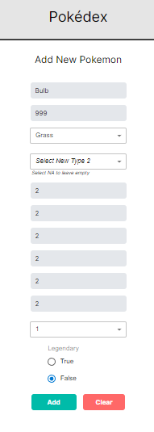

### 2) Main Page

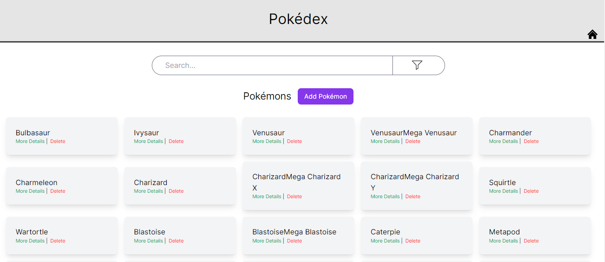

### 3) Search

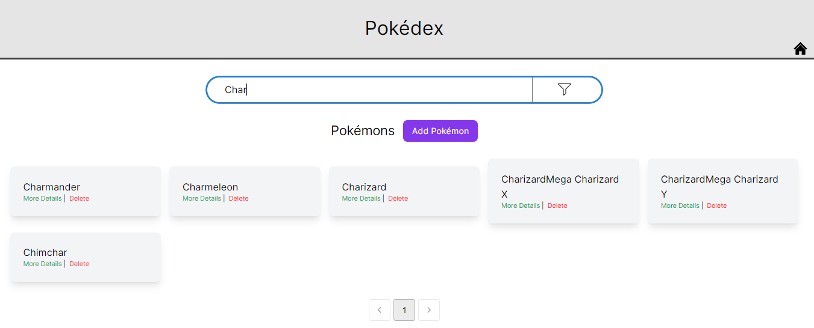

### 4) Filter

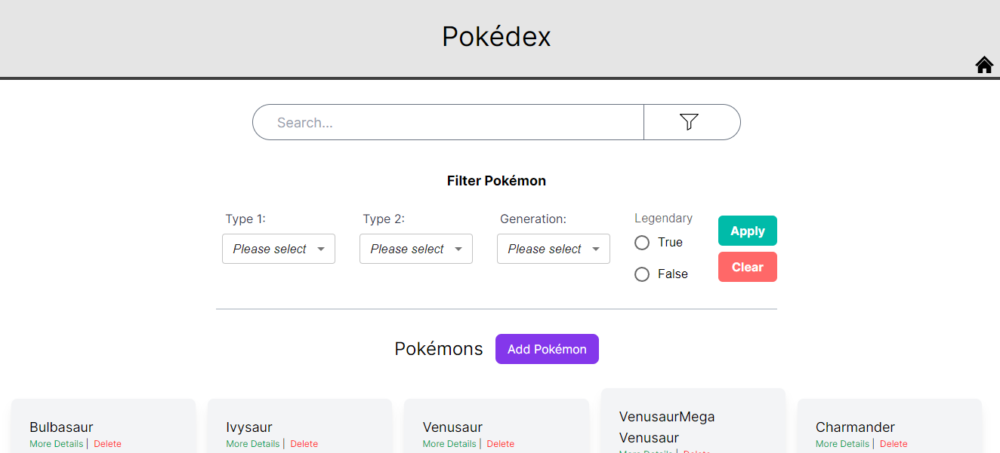

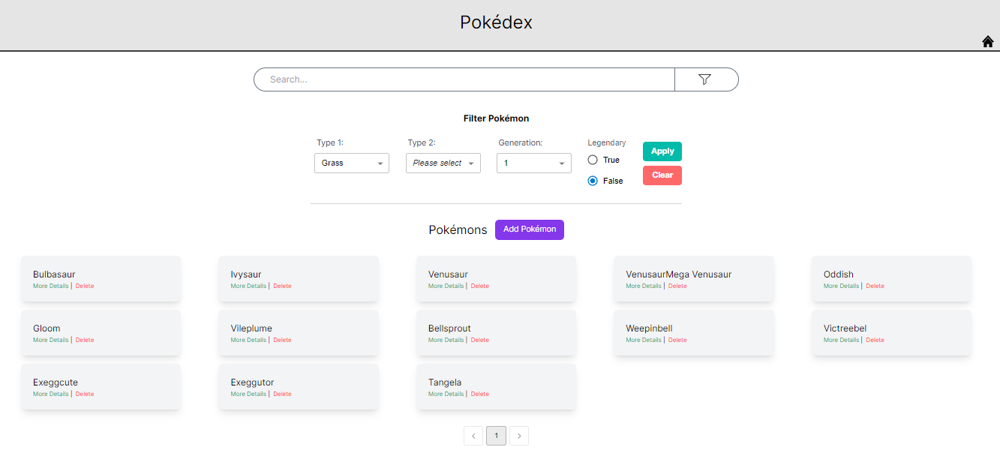

### 5) Add

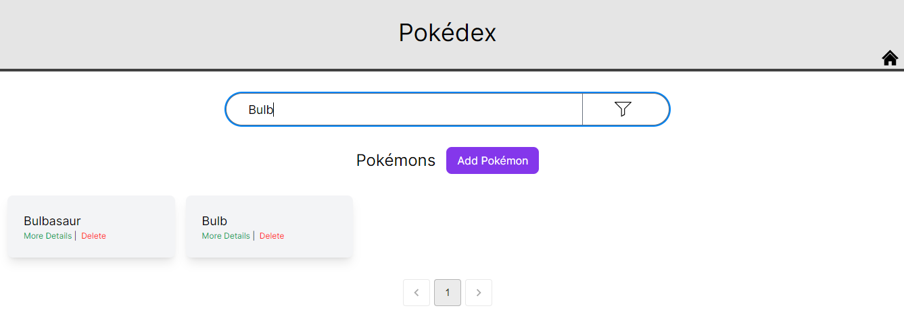

### 6) More Details

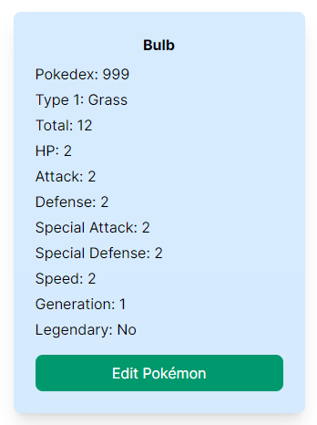

### 7) Edit

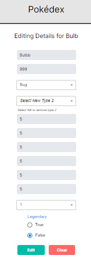

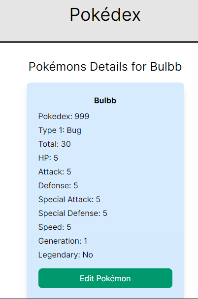

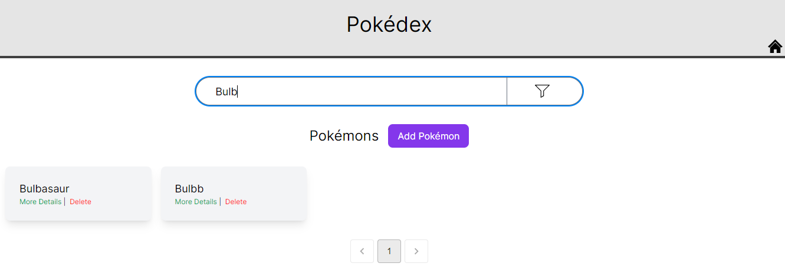

### 8) Delete

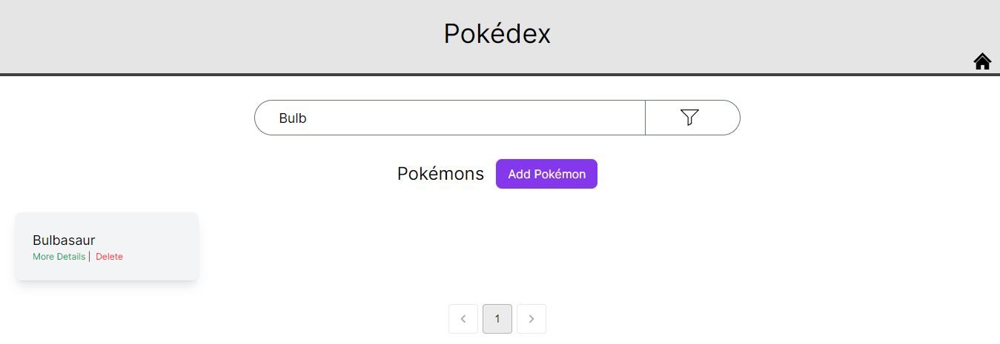

