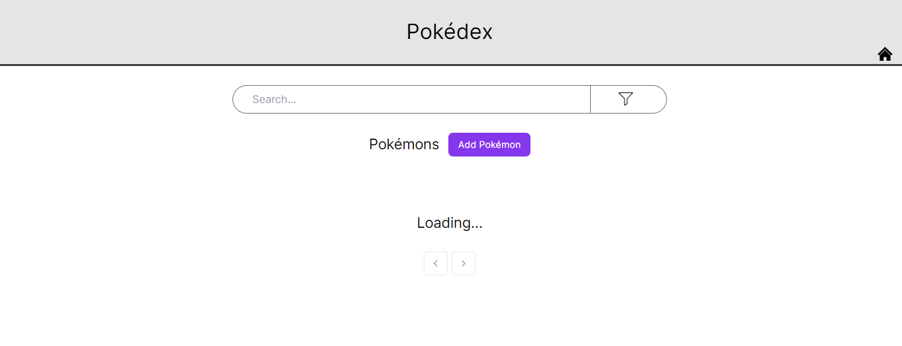

# pokemon-nextjs
sample fullstack (PERN stack) pokemon site to filter and look at statistics of pokemon

created with nextjs (react), tailwind, material UI, postgres, express, node

# Features (with images)

### 1) Loading

- Before there is a connection with the database, the page will show a loading screen

### 2) Main Page

- This is the main page

### 3) Search

- We can search using the names of Pokémon 

### 4) Filter

- The filter panel allows for filtering of Pokémons based on some criterion

- After applying the filters, the results will appear immediately

### 5) Add

- This page allows us to add new Pokémons

- We can search for our newly added Pokémon

### 6) More Details

- This page will show the statistics of each Pokémon

### 7) Edit

- This page allows us to edit the Pokémon details

- Details of the Pokémon has been updated

- Pokémon with name "Bulb" has been renamed to "Bulbb" after editing

### 8) Delete

- We can delete the Pokémon and will no longer be found

